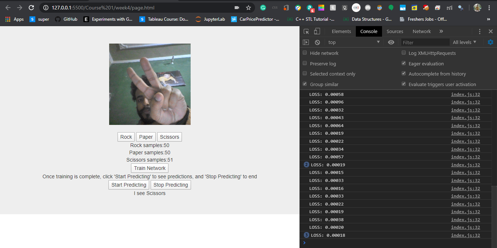

# Rock-Paper-Scissors
This is teachable rock paper scissors web app, which i using tensorflowjs and mobilenet to classifiy various action of hand into rock , paper and scissors.

This project is a part of the Deep Learning Specilization course from Coursera.
#### How to use APP:
'''bash
  1. Collect Samples of various rock paper scissors images
  2. Train network and wait for the alert
  3. Click on start predicting to start the prediction using webcam
'''

##### Watch Live Demo <a href="https://chiragsaini.github.io/Rock-Paper-Scissors/"> here </a> 

## Files:

#### Page.html
First is page.html which basically has all the front end related stuff regrading this app.

#### Index.js
Index.js is the main js file which handles the downloading , loading and transfer learning from mobilenet into our application.
We can train this mobilenet and train it according to our need.

#### Webcam.js
This webcam.js is a js file made by Google to handle all the webcam related stuff

#### RPS-Dataset.js
This file is helping to create the dataset of the intermediate images from our mobilenet and labels for our neural network.

## Screenshots:
##### Predicting Paper

##### predicting Scissors

